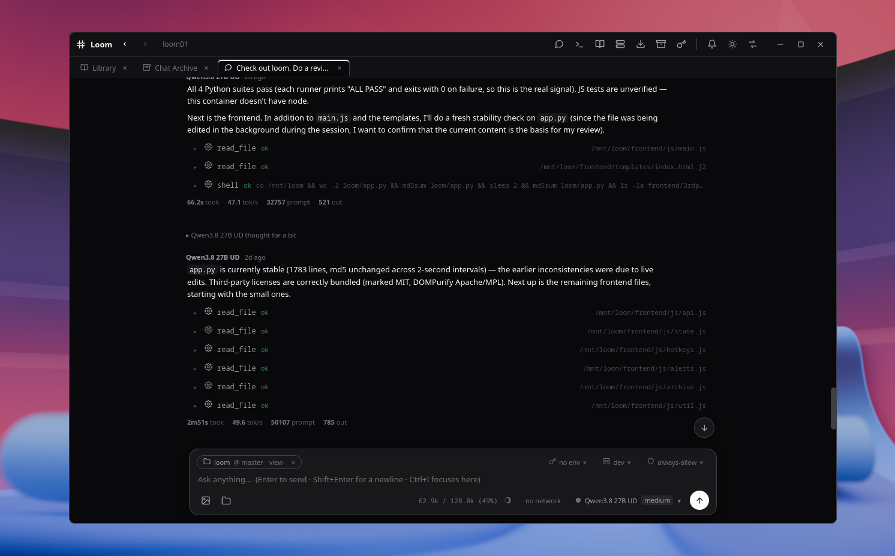
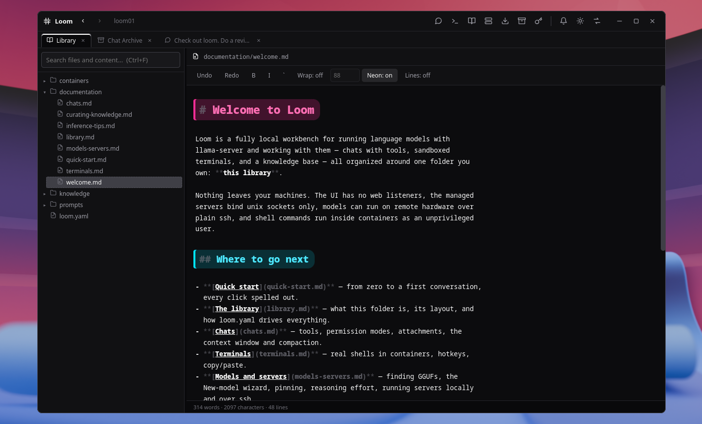

# Loom

A secure agentic workbench built on top of [llama-cpp](https://github.com/ggml-org/llama.cpp) tools for local AI.

Most noteable features:
- All shell commands happen inside podman/docker containers.
- Direct control over llama-server flags
- Built-in knowledge system
- Model management tools
- Remote inference over ssh using llama-server
- No exposure to base filesystem
- Networking off by default inside containers

What has been cooked up in this repo is a secure agent that you customize for your use-cases.

This project is feature complete, future work will be focused on UI/workflow improvements and bug fixes.
The goal is to make the app easy so that all that is necessary to get started is:
```
git clone https://github.com/synthstation/loom.git
cd loom
make install
loom
```

Right now you need to know the getting started flow is `download/scan for models -> create a new server of the model -> start the server -> chat with the model/server`.

## Screenshots

**Chat**



**Library**



---

This README is the only human maintained file in this repo, the LLMs used to produce this maintain README.AI-GEN.md.
